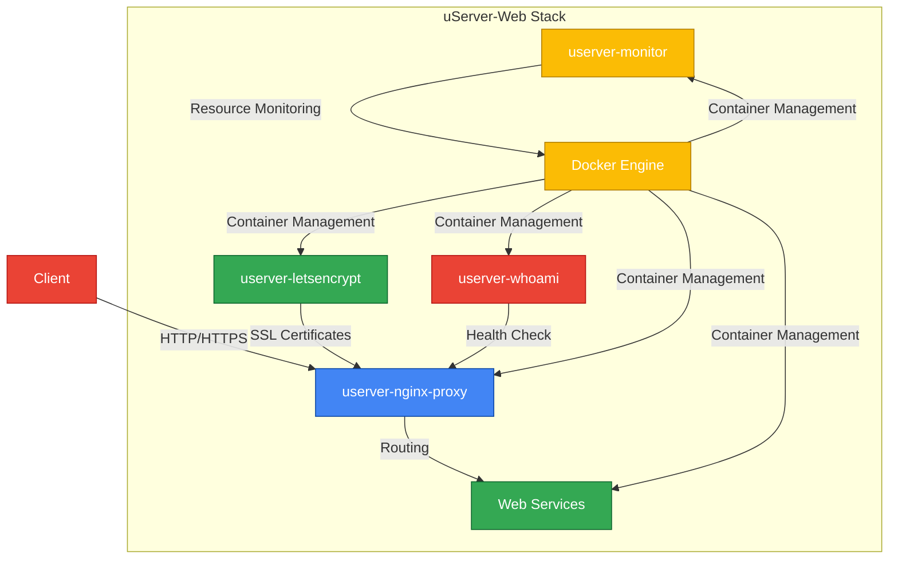
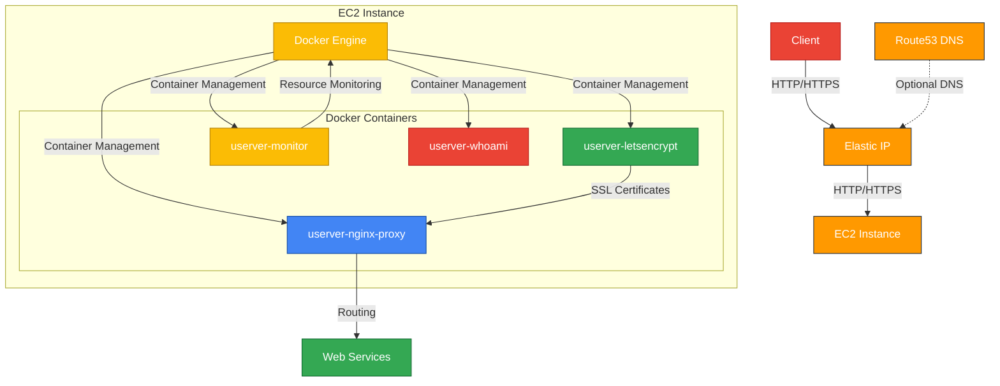
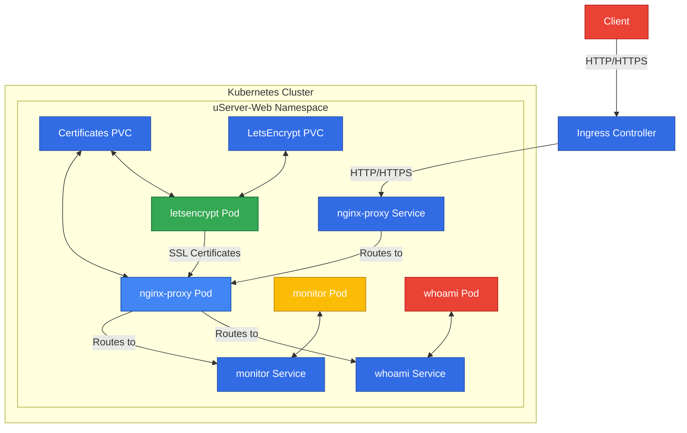

# uServer-Web Architecture

This document describes the architecture of the uServer-Web stack.

## Overview

uServer-Web is a microservices stack for web hosting that provides reverse proxy, SSL management, container monitoring, and health checking capabilities. It can be deployed using Docker Compose, Terraform (AWS), or Kubernetes (Helm).

## Architecture Diagrams

### Docker Compose Architecture

### AWS Architecture (Terraform)

### Kubernetes Architecture (Helm)

## Components

### Core Components

#### userver-nginx-proxy

The nginx-proxy service is the entry point for all HTTP/HTTPS traffic. It routes requests to the appropriate services based on the hostname.

- **Image**: nginxproxy/nginx-proxy:1.5-alpine
- **Ports**: 80, 443
- **Volumes**:
  - Certificates
  - Configuration
  - Logs
  - Docker socket (for auto-discovery)

#### userver-letsencrypt

The Let's Encrypt service automatically obtains and renews SSL certificates for the domains configured in the services.

- **Image**: nginxproxy/acme-companion:2.3
- **Dependencies**: userver-nginx-proxy
- **Volumes**:
  - Certificates
  - Docker socket (for auto-discovery)

#### userver-monitor

The monitor service provides resource usage monitoring for all containers in the stack.

- **Image**: ferdn4ndo/docker-containers-monitor:1.0.1
- **Volumes**:
  - Docker socket (for container monitoring)

#### userver-whoami

The whoami service provides a simple health check endpoint that returns information about the request.

- **Image**: traefik/whoami:v1.10
- **Ports**: 80 (exposed)

### Deployment-Specific Components

#### Docker Compose Deployment

- **Docker Compose**: Orchestrates the containers
- **Docker Network**: `nginx-proxy` network for container communication
- **Environment Files**: Configuration for each service

#### AWS Deployment (Terraform)

- **VPC**: Virtual Private Cloud for network isolation
- **Subnet**: Public subnet for the EC2 instance
- **Security Group**: Firewall rules for the EC2 instance
- **EC2 Instance**: Hosts the Docker containers
- **Elastic IP**: Static IP address for the EC2 instance
- **Route53 Records** (optional): DNS records for the services

#### Kubernetes Deployment (Helm)

- **Deployments**: Kubernetes Deployments for each service
- **Services**: Kubernetes Services for each component
- **PersistentVolumeClaims**: For storing certificates and configuration
- **ConfigMaps**: For nginx configuration
- **ServiceAccount**: For RBAC
- **Ingress** (optional): For routing external traffic

## Data Flow

### Common Data Flow

1. Client sends HTTP/HTTPS request to the server
2. userver-nginx-proxy receives the request and routes it to the appropriate service based on the hostname
3. If HTTPS is used, userver-letsencrypt provides the SSL certificate
4. The service processes the request and returns a response
5. userver-nginx-proxy forwards the response to the client
6. userver-monitor continuously monitors the resource usage of all containers

### Docker Compose Data Flow

- All services are connected to the `nginx-proxy` network
- Docker socket is mounted into containers for auto-discovery
- Environment variables are used for configuration

### AWS Data Flow (Terraform)

- Traffic enters through the Elastic IP
- EC2 instance runs all containers
- Docker Compose manages the containers within the EC2 instance
- Route53 can be used for DNS management

### Kubernetes Data Flow (Helm)

- Traffic enters through the Ingress Controller
- Ingress routes to the nginx-proxy Service
- Services route to the appropriate Pods
- PersistentVolumeClaims provide persistent storage
- ConfigMaps provide configuration

## Security Considerations

### Common Security Considerations

- SSL certificates are automatically managed and renewed
- HTTP traffic can be redirected to HTTPS

### Docker Compose Security Considerations

- The Docker socket is mounted as read-only where possible
- Environment variables are used for sensitive configuration

### AWS Security Considerations (Terraform)

- Security Group restricts access to the EC2 instance
- SSH access can be limited to specific IP addresses
- EC2 instance is deployed in a VPC for network isolation

### Kubernetes Security Considerations (Helm)

- ServiceAccount with appropriate RBAC permissions
- Secrets for sensitive configuration
- Network Policies can be used to restrict traffic between Pods
